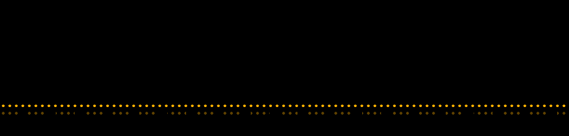

[](https://signalboarder.alcun.dev)

# Signalboarder

A live UK train departure board for a browser, an old tablet or a small screen
on a shelf. Choose a station and leave it running.

[Open the board](https://signalboarder.alcun.dev) ·
[Build the ESP32 version](https://github.com/alcun/signalboarder-device)

The platform view shows the next three trains, calling points and a clock.
Tap the clock for the concourse view, with up to ten departures. Search by
station name or three-letter code; your choice is saved in the browser and
can be shared as a link, such as [`?s=NBN`](https://signalboarder.alcun.dev/?s=NBN).

## Run your own

With Docker installed and running:

```sh
git clone https://github.com/alcun/signalboarder.git
cd signalboarder
./setup
```

The setup script offers three sources of departures:

- **Your National Rail key**, for an independent live board.
- **The hosted service**, for trying it without an account. This uses the
  shared service's limits.
- **Demo departures**, for development without a key. Once installed, this
  mode works offline.

Open [localhost:3000](http://localhost:3000). For the demo, choose New Brighton
(`NBN`) or Greenwich (`GNW`). The API also has an empty-board fixture at `ZZZ`.

One container serves the website and departure API. There is no database, and
National Rail credentials stay on the server. See [self-hosting](SELFHOSTING.md)
for configuration, limits and running behind HTTPS.

## Use with an AI assistant

Connect a remote MCP client to `https://signalboarder.alcun.dev/mcp` using
Streamable HTTP. No account or API key is needed. Ask for departures using a
three-letter station code, for example “Show the next five trains from KGX”.
The read-only `get_departures` tool shares the board's data and service limits.
See [MCP setup and examples](edge/README.md#mcp-setup).

## Development

The website is static Astro with a TypeScript client. The API uses Bun and
Hono to fetch, normalise and cache National Rail data. The
[firmware](https://github.com/alcun/signalboarder-device) reads the same API.

```sh
(cd edge && bun install --frozen-lockfile)
(cd web && npm ci)
bun test
npm run build --prefix web
SIGNALBOARDER_PROVIDER=fixture SIGNALBOARDER_WEB_ROOT=./web/dist \
  bun run edge/src/index.ts
```

This serves the built site and demo API at `http://localhost:3000`.
Bun, Node.js 22.12 or later, and npm 9.6.5 or later are needed for this path.

The [web README](web/README.md) covers local development and board behaviour;
the [API README](edge/README.md) describes the response format and errors.
Architecture is described in [DECISIONS.md](DECISIONS.md), and changes are in
[CHANGELOG.md](CHANGELOG.md).

## Licence and credits

The code is [MIT licensed](LICENSE). Bundled assets keep their own licences:

- Daniel Hart's [Dot Matrix typeface](web/public/fonts/README.txt), under the
  SIL Open Font License 1.1.
- The [station dataset](web/data/README.txt), from Dav Wheat and Trainline EU,
  under the Open Database License.

Live departure data is supplied by National Rail Enquiries. No provider key
is included; using your own key is subject to your Rail Data Marketplace
subscription terms.
